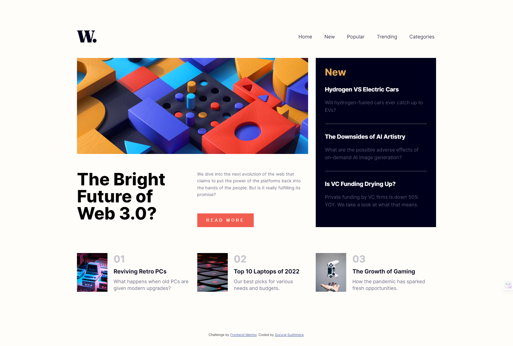

# Frontend Mentor - News homepage solution

  

This is a solution to the [News homepage challenge on Frontend Mentor](https://www.frontendmentor.io/challenges/news-homepage-H6SWTa1MFl). Frontend Mentor challenges help you improve your coding skills by building realistic projects.

  

## Table of contents

  

- [Overview](#overview)

- [The challenge](#the-challenge)

- [Screenshot](#screenshot)

- [Links](#links)

- [Built with](#built-with)

- [Acknowledgments](#acknowledgments)
	
  

  

## Overview

  

### The challenge

  

Users should be able to:

  

- View the optimal layout for the interface depending on their device's screen size

- See hover and focus states for all interactive elements on the page

  

### Screenshot

  

  

  

### Links

  

- Solution URL: [solution URL ](https://github.com/SG75/news-homepage-main)

- Live Site URL: [live site URL](https://news-homepage-main-fawn-one.vercel.app/)

  

  

### Built with

  

- Semantic HTML5 markup

- CSS custom properties

- Flexbox

- CSS Grid

- Mobile-first workflow

  

## Author

  

- Website - [Gururaj Sudhindra](https://sg75.in)

- Frontend Mentor - [@SG75](https://www.frontendmentor.io/profile/SG75)

  

## Acknowledgments

  
I've taken ideas from the following resources
    1. [W3S](https://www.w3schools.com/css/css_grid_item.asp)
	2. [WDS](https://www.youtube.com/watch?v=At4B7A4GOPg)
